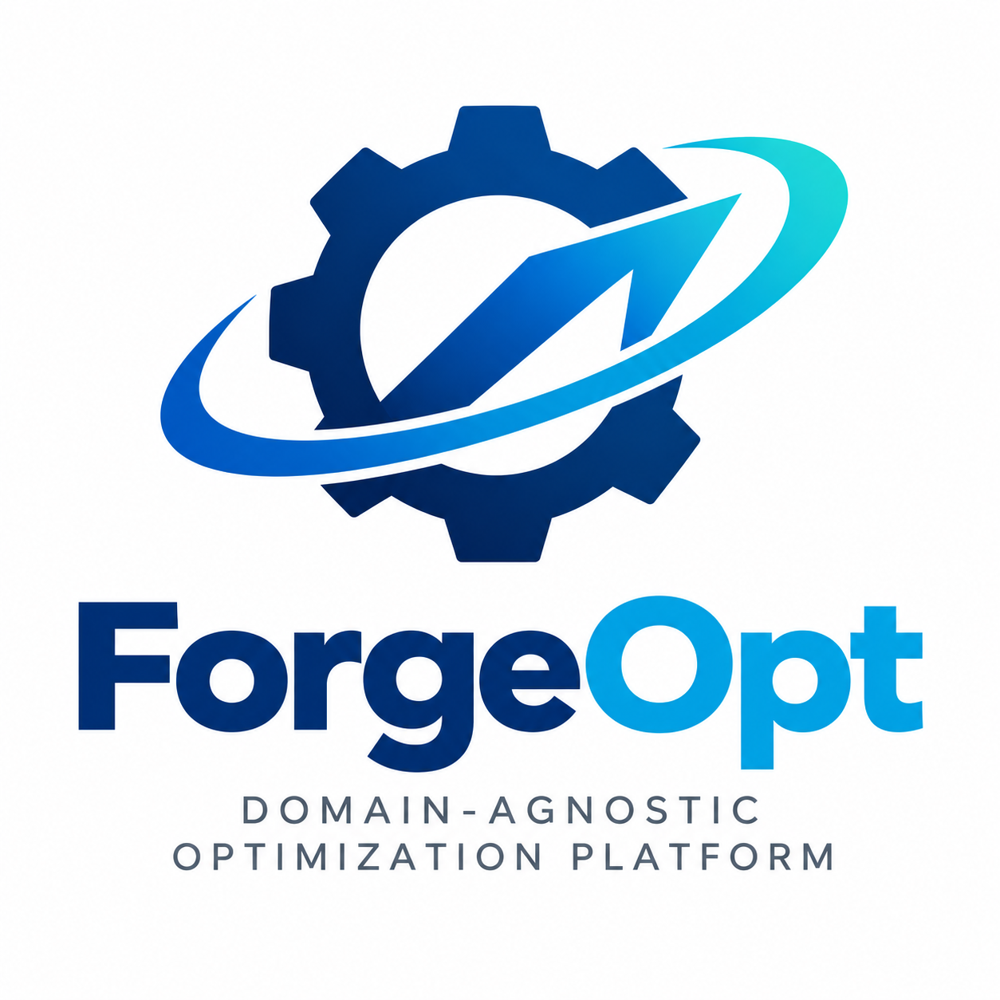

# ForgeOpt

> **Manufacturing Optimization**

<!--
Logo
Proposed location:
assets/logos/forgeopt-logo.png

When the logo asset is available, use:


-->


## Overview

**ForgeOpt** is the manufacturing-domain application of the VarOpt optimization platform.

ForgeOpt is intended to address optimization problems arising in complex manufacturing systems, including planning, scheduling, resource allocation, sequencing, and dynamic reoptimization.

The initial reference application is **spacecraft manufacturing**.

## Relationship to VarOpt

ForgeOpt is built on the VarOpt platform.

```text
                    VarOpt
        Domain-Agnostic Optimization
                    Platform
                       |
                       v
                   ForgeOpt
             Manufacturing Optimization
                       |
                       v
             Spacecraft Manufacturing
```

VarOpt provides the domain-agnostic optimization concepts and platform capabilities.

ForgeOpt provides the manufacturing-specific:

* domain model;
* manufacturing constraints;
* resources;
* operations;
* qualifications;
* materials;
* spatial relationships;
* calendars;
* manufacturing state;
* domain-specific performance models; and
* manufacturing-specific decision structures.

## Reference Domain

The initial reference domain is **spacecraft manufacturing**.

The spacecraft-manufacturing problem provides a demanding reference case involving potentially large collections of operations with:

* precedence relationships;
* shared resources;
* resource qualifications;
* material dependencies;
* spatial constraints;
* production calendars;
* operation durations;
* changing availability;
* schedule stability;
* local optimization decisions; and
* global production objectives.

The architecture is intended to remain applicable to other complex manufacturing environments.

## Optimization Focus

ForgeOpt will investigate optimization of manufacturing decisions including, as appropriate:

* operation sequencing;
* scheduling;
* resource assignment;
* production timing;
* workforce and qualification constraints;
* material availability;
* facility constraints;
* spatial constraints;
* production stability;
* schedule churn;
* local versus global optimization; and
* dynamic replanning.

## Documentation

The ForgeOpt documentation will eventually include:

* ForgeOpt System Definition Specification
* Manufacturing Domain Model
* ForgeOpt Architecture
* Spacecraft Manufacturing Reference Model
* Optimization Formulations
* Validation Problems
* Experiments
* Benchmarks

## Development Status

**Current status: Domain architecture / foundation phase**

ForgeOpt is being developed as a domain application of VarOpt rather than as a separate optimization framework.

## Design Principle

ForgeOpt should contribute meaningful manufacturing requirements and validation problems to VarOpt without causing manufacturing-specific assumptions to become part of the VarOpt core.

Where a capability proves genuinely domain-independent, it may be incorporated into the VarOpt platform.

## Repository Location

```text
domains/ForgeOpt/
```

## Maintainer

ForgeOpt is developed as part of the VarOpt project and maintained by Chris Romero.
